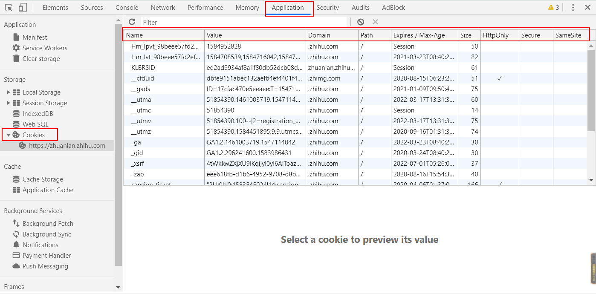
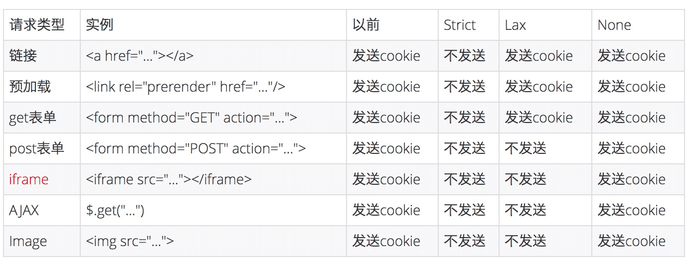

# 005: 这个cookie不太难

<motto></motto>

## 什么是cookie

Cookie是服务器给客户端发的一个 `通行证` 。

每当访问服务器时都要携带自己的通行证，这样服务器就可以确定用户身份。

> Cookie（复数形态Cookies），类型为「小型文本文件」，指某些网站为了辨别用户身份而储存在用户本地终端上的数据。——维基百科

cookie是一般不超过 4KB 的小型文本数据，它由一个名称（Name）、一个值（Value）和其它几个用于控制 Cookie 有效期、安全性、使用范围的可选属性组成。

HTTP 是无状态的协议（对于事务处理没有记忆能力，每次客户端和服务端会话完成时，服务端不 会保存任何会话信息），注意这里指的是HTTP1.x：每个请求都是完全独立的，服务端无法确认当前访问者的身份信息，无法分辨上一次的请求发送者和这一次的发送者是不是同一个人。即使同一个客户端连续两次发送请求给服务器，服务器也识别不出这是同一个客户端发送的请求。

所以服务器与浏览器为了进行会话跟踪（知道是谁在访问我），就必须主动的去维护一个状态，这个状态用于告知服务端前后两个请求 是否来自同一浏览器。而这个状态需要通过 cookie 或者 session 去实现。 

cookie 存储在客户端： cookie 是服务器发送到用户浏览器并保存在本地的一小块数据，它会在 浏览器下次向同一服务器再发起请求时被携带并发送到服务器上。 

## cookie长什么样子

可以在浏览器开发者工具中的Application里看到：



但cookie 并不只是存放在浏览器里的。实际上，Cookie相关的内容还可以存在本地文件里，就比如说 Mac 下的 Chrome，存放目录就是 `~/Library/Application Support/Google/Chrome/Default` ，里面会有一个名为 Cookies 的数据库文件，我们可以使用 sqlite 软件打开它。

## cookie怎么设置

1. 客户端发送 HTTP 请求到服务器
2. 当服务器收到 HTTP 请求时，在响应头里面添加一个 `Set-Cookie` 字段
3. 浏览器收到响应后保存下 Cookie
4. 之后对该服务器每一次请求中都通过 Cookie 字段将 Cookie 信息发送给服务器。

注意：要设置多个cookie时，得多写几个 `Set-Cookie` 。

## cookie在请求流程中的'角色'

1. 用户 `baitang` 在浏览器端输入用户名密码, 发起POST请求到后端服务器。后端服务器验证合法，返回Response，并 `Set-Cookie` 为 `sessionid=***;username=baitang;` 。
2. 浏览器端在接收到HTTP响应后，发现 `Set-Cookie` ，将其存入本地内存或硬盘中。
3. 浏览器端再次发起请求，带上Cookie信息 `sessionid=***;username=baitang;` ，请求修改自己的头像信息。
4. 服务器根据 `sessionid` 验证当前用户已登陆，根据 `username` , 查找数据库中的对应数据，修改头像信息。

## cookie不可跨域

cookie 是不可跨域的： 每个 cookie 都会绑定单一的域名，无法在别的域名下获取使用，一级域名和二级域名之间是允许共享使用的（靠的是 domain）。

## cookie的属性

cookie 的属性格式是 `name=value键值对` ，可以设置 Cookie 的名称及相对应的值，都必须是字符串类型。

* 如果值为 Unicode 字符，需要为字符编码。 
* 如果值为二进制数据，则需要使用 BASE64 编码。

从上图我们可以看到，cookie的属性有这些：

* `Name` : 该Cookie的 `名称` 。Cookie一旦创建，名称便不可更改。

* `Value` : 该Cookie的 `值` 。

* `Domain` : 设置可以访问该Cookie的 `域名` 。

  Domain 指定了 Cookie 可以送达的主机名。假如没有指定，那么默认值为当前文档访问地址中的主机部分（但是不包含子域名）。

* `Path` : 该Cookie的 `使用路径` 。

  如果设置为“/test/”，则只有“http://xxx.xxx.xxx/test”的程序可以访问该Cookie。如果设置为“/”，则本域名下的程序都可以访问Cookie，注意最后一个字符必须为“/”。

  Domain 和 Path 标识共同定义了 Cookie 的作用域：即 Cookie 应该发送给哪些 URL。

* `Expires` : 设置该 Cookie 的过期时间, 如： `2020-04-09T04:28:40.537Z` 。

  当 Expires 属性缺省时，表示是会话性 Cookie，像上图 Expires 的值为 Session，表示的就是 `会话性 Cookie` 。当为会话性 Cookie 的时候，值保存在客户端内存中，并 `在用户关闭浏览器时失效` 。需要注意的是，有些浏览器提供了 `会话恢复` 功能，这种情况下即使关闭了浏览器，会话期 Cookie 也会被保留下来，就好像浏览器从来没有关闭一样。

  与会话性 Cookie 相对的是持久性 Cookie，持久性 Cookies 会保存在用户的硬盘中，直至过期或者清除 Cookie。这里值得注意的是，设定的日期和时间只与客户端相关，而不是服务端。

* `Max-Age` : 设置在 Cookie 失效之前需要经过的秒数.

  Max-Age 可以为正数、负数、甚至是 0。

  + 如果 max-Age 属性为正数时，浏览器会将其持久化，即写到对应的 Cookie 文件中。

  + 当 max-Age 属性为负数，则表示该 Cookie 只是一个会话性 Cookie。

  + 当 max-Age 为 0 时，则会立即删除这个 Cookie。

  **假如 Expires 和 Max-Age 都存在，Max-Age 优先级更高。**

* `Size` : 该cookie的大小

* `HttpOnly` : 设置 HTTPOnly 属性可以防止客户端脚本通过 document.cookie 等方式访问 Cookie，有助于避免 XSS 攻击。

  也就是说，这个Only，only在了cookie只能够在http协议中传输， 除此以外都不可以都不可以获取到cookie。当然你要是自己按下F12，点开application的cookies对某个cookie进行复制，那确实也能够获取到。。。

  tips：document.cookie可以对cookie进行读写：
  

``` js
  //读取浏览器中的cookie
  console.log(document.cookie);
  //写入cookie
  document.cookie = 'username=baitang;path=/;domain=.baidu.com';
```

  如果某个 cookie 设置了 httpOnly 属性，则无法通过 JS 脚本 读取到该 cookie 的信息，但还是能通过 Application 中手动修改 cookie，所以只是在一定程度上可以防止 XSS 攻击，不是绝对的安全。

* Secure: `是否仅使用安全协议传输` ，默认为false。

  标记为 Secure 的 Cookie 只应通过被HTTPS协议加密过的请求发送给服务端。使用 HTTPS 安全协议，可以保护 Cookie 在浏览器和 Web 服务器间的传输过程中不被窃取和篡改。

* SameSite: 可以让 Cookie 在跨站请求时不会被发送，从而可以阻止跨站请求伪造攻击（CSRF）。

  SameSite 可以有下面三种值：

  1. **Strict** ：仅允许第一方请求携带 Cookie，即浏览器将只发送同一站点请求的 Cookie，即**当前网页 URL 与请求目标 URL 完全一致**。

  2.**Lax** ：只允许在 `get方法提交表单` 和 `a标签发送get请求` 请求携带 Cookie。

  3. **None** ：无论是否跨站，请求都会自动携带上 Cookie。

  **之前默认是 `None` 的，Chrome80 后默认是 `Lax` 。**

## Chrome80默认SameSite 



对大部分 web 应用而言，Post 表单，iframe，AJAX，Image 这四种情况从以前的跨站会发送三方 Cookie，变成了不发送。

Post表单：应该的，学 CSRF 总会举表单的例子。

iframe：iframe 嵌入的 web 应用有很多是跨站的，都会受到影响。

AJAX：可能会影响部分前端取值的行为和结果。

Image：图片一般放 CDN，大部分情况不需要 Cookie，故影响有限。但如果引用了需要鉴权的图片，可能会受到影响。

除了这些还有 script 的方式，这种方式也不会发送 Cookie，像淘宝的大部分请求都是 jsonp，如果涉及到跨站也有可能会被影响。

### 跨域和跨站

首先要理解的一点就是跨站和跨域是不同的。

同站(same-site)/跨站(cross-site)」和第一方(first-party)/第三方(third-party)是等价的。但是与浏览器同源策略（SOP）中的「同源(same-origin)/跨域(cross-origin)」是完全不同的概念。

同源策略的同源是指两个 URL 的协议/主机名/端口一致。例如，[www.taobao.com/pages/](https://www.taobao.com/pages/)... ，它的协议是 https，主机名是 www.taobao.com，端口是 443。

同源策略作为浏览器的安全基石，其「同源」判断是比较严格的，相对而言，Cookie中的「同站」判断就比较宽松：只要两个 URL 的 eTLD+1 相同即可，不需要考虑协议和端口。其中，eTLD 表示有效顶级域名，注册于 Mozilla 维护的公共后缀列表（Public Suffix List）中，例如，.com、.co.uk、.github.io 等。eTLD+1 则表示，有效顶级域名+二级域名，例如 taobao.com 等。

举几个例子，www.taobao.com 和 www.baidu.com 是跨站，www.a.taobao.com 和 www.b.taobao.com 是同站，a.github.io 和 b.github.io 是跨站(注意是跨站)。

## 如何修改删除cookie

**修改**：创建同名Cookie，覆盖原来的Cookie

**删除**：创建同名Cookie，并将maxAge属性设置为0

## cookie的用处

* 会话状态管理（如用户登录状态、购物车、游戏分数或其它需要记录的信息）
* 个性化设置（如用户自定义设置、主题等）
* 浏览器行为跟踪（如跟踪分析用户行为等）

## cookie的缺点

1. 性能上，Cookie 紧跟域名，在SameSite设置为None时，不管域名下面的某一个地址需不需要这个 Cookie ，请求都会携带上完整的 Cookie，这样随着请求数的增多，会造成巨大的性能浪费，因为请求携带了很多不必要的内容。但可以通过 `Domain` 和 `Path` 指定**作用域**来解决。
2. 访问上，cookie与浏览器相关，不能互相访问。
3. 安全上，cookie安全性不够高， Cookie 会在浏览器和服务器之间进行传递，很容易被截获从而进行篡改。
4. 容量上，cookie存储空间很小(只有4–10KB左右)。
5. 还有就是，cookie可能被用户删除。

## cookie的防篡改

### 为什么Cookie需要防篡改

为什么要做Cookie防篡改，一个重要原因是 **Cookie中存储有判断当前登陆用户会话信息（Session）的会话票据-SessionID和一些用户信息**。 

当发起一个HTTP请求，HTTP请求头会带上Cookie，Cookie里面就包含有SessionID。 后端服务根据SessionID，去获取当前的会话信息。如果会话信息存在，则代表该请求的用户已经登陆。 服务器根据登陆用户的权限，返回请求的数据到浏览器端。

因为Cookie是存储在客户端，用户可以随意修改。所以，存在一定的安全隐患。

### 防篡改签名

> 服务器为每个Cookie项生成签名。如果用户篡改Cookie，则与签名无法对应上。以此，来判断数据是否被篡改。

**原理如下：**

* 服务端提供一个签名生成算法 `secret` 
* 根据方法生成签名 `secret(baitang)=34Yult8i` 
* 将生成的签名放入对应的Cookie项 `username=baitang|34Yult8i` 。其中，内容和签名用 `|` 隔开。
* 服务端根据接收到的内容和签名，校验内容是否被篡改。

小栗子：

比如服务器接收到请求中的Cookie项 `username=pony|34Yult8i` ，然后使用签名生成算法 `secret(pony)=666` 。 算法得到的签名 `666` 和请求中数据的签名不一致，则证明数据被篡改。

### 敏感数据的保护

鉴于Cookie的安全性隐患，敏感数据都应避免存储在Cookie。 应该根据SessionID，将敏感数据存储在后端。取数据时，根据SessionID去后端服务器获取即可。 另外，对一些重要的Cookie项，应该生成对应的签名，来防止被恶意篡改。

